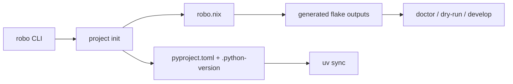

# robo-nix

[](./.github/workflows/ci.yml)
[](./.github/workflows/gpu-smoke.yml)
[](https://nixos.org/)
[](#quick-start)
[](#snapshot)

> Robot-learning environments should feel like a tool, not a setup ritual.

`robo-nix` is a robot-learning environment toolkit built on Nix and uv.

The product goal is simple:

```bash
robo init robot-learning
cd robot-learning
robo doctor
robo sync
robo develop
```

Researchers should be able to use normal Python tooling while getting the native robotics libraries that `pyproject.toml` cannot express.

## Quick Start

The `robo` CLI is the intended user-facing entrypoint. The beginner path is:

```bash
robo init .
robo doctor
robo sync
robo run pytest tests
```

In the current alpha, run it through Nix:

```bash
nix run github:ausbxuse/robo-nix#robo -- init .
nix run github:ausbxuse/robo-nix#robo -- doctor
nix run github:ausbxuse/robo-nix#robo -- sync --group dev
nix run github:ausbxuse/robo-nix#robo -- run pytest tests
```

For an existing robot-learning repo, initialize the runtime in place:

```bash
cd ~/src/dev/dexmate-teleop-develop
nix run github:ausbxuse/robo-nix#robo -- init .
```

That writes the generated Nix plumbing and a small `robo.nix`.
Existing `pyproject.toml` and `uv.lock` remain project-owned.
By default, `robo init` probes `pyproject.toml` and common workspace paths to add reusable runtime components such as `x11-gl`, `media`, `mujoco`, `qt6`, and `linux-headers`.
Generated projects point at the `robo-nix` source shipped with the CLI package by default. Maintainers can override that explicitly with `--robo-nix-url path:/path/to/robo-nix`.

Packaged installs include bash, zsh, and fish completions.
CLI output is colored only on interactive terminals and follows `NO_COLOR`; use `--debug` when you want raw subprocess commands and bootstrap output.

Use `robo doctor --why` to see why runtime entries were selected. Use `robo contract --json` for machine-readable audit output.

## Why Researchers Should Care

Robot-learning projects usually fail at the boundary between Python and the machine:

| Common failure | robo / robo-nix answer |
| --- | --- |
| Conda installs Python packages but not the right native runtime | Nix provides compilers, GL, FFmpeg, ROS, CUDA hooks, and simulator/runtime libraries |
| Docker hides the host but makes robotics hardware, GUI, and iteration awkward | `robo develop` gives a local dev shell instead of forcing the whole workflow into a container |
| Fresh machines fail with unclear import/runtime errors | `robo doctor` is designed to explain missing host/runtime pieces in robotics language |
| Labs copy long setup READMEs across projects | `robo init` should encode the happy path and keep generated files small |
| Every repo has different Python pins | uv owns `.python-version`, `.venv`, `pyproject.toml`, and `uv.lock` |
| A central tool cannot support every robot/project | Downstream projects own their manifest and project-specific vendor policy |

The pitch is not “learn Nix.” The pitch is:

> Use uv like normal. Use robo to get the native robotics runtime right.

## Design Boundary

`robo-nix` deliberately does not try to become a universal robotics package registry.

| Layer | Owner | Responsibility |
| --- | --- | --- |
| `robo` | CLI | UX, init, doctor, sync, develop, error explanations |
| `robo-nix` | Runtime backend | Components, flake outputs, generated shells, checks |
| uv | Python | Python version, virtualenv, dependencies, `uv.lock` |
| Nix | Runtime | Native libraries, CUDA/graphics/ROS/sim tooling, compilers, shell environment |
| Downstream repo | Project | Python deps, training code, robot/vendor policy, assets |

This keeps the core maintainable while still solving the part that hurts in real robotics environments.

## User-Facing Files

Beginner users should mostly care about:

```text
pyproject.toml
uv.lock
.python-version
src/
```

Runtime changes live in:

```text
robo.nix
```

Nix plumbing is generated and should usually be left alone:

```text
flake.nix
flake.lock
```

The `robo` CLI should manage that plumbing.

## Final Goal

`robo-nix` should infer and document the native runtime implied by a uv-managed Python project.

The center of gravity is `pyproject.toml` plus `uv.lock`: users declare Python packages normally, then `robo doctor` helps fill the missing system layer for packages like OpenCV, PyAV, MuJoCo, CUDA extensions, ROS tools, and simulator bindings.

Users should not need to understand flakes to get value. The generated flake is a stepping stone: visible, inspectable, and documented, but not something beginners are expected to maintain by hand.

## Snapshot

| Area | Current |
| --- | --- |
| Reusable components | 12 |
| Starter profiles | 4 |
| Docs pages | 13 |
| Validation scripts | 8 |
| CI tiers | Ubuntu, macOS, GPU |

## Shape



## Good Fit

| Strong fit | Not worth forcing |
| --- | --- |
| ROS, Qt, CUDA, simulator, or native-runtime-heavy stacks | Tiny repos with 1-2 setup commands |
| Labs provisioning fresh machines often | Pure Python repos with no real system complexity |
| Robot-learning repos with native wheels and host runtime needs | Projects where Nix adds more ceremony than value |
| Teams that want reproducible dev shells without Docker-first workflow | One-off scripts with no onboarding pain |

## What’s Included

- Components for core tooling, media, ROS, MuJoCo, Isaac, CUDA, and graphics/runtime flows
- uv-managed Python versions via `.python-version`
- A CLI initializer for downstream project runtime setup
- `doctor`, `dry-run`, `bootstrap`, `sync`, and `run` entrypoints
- Regression tests, robo init validation, fixture validation, and CI

## Roadmap

| Priority | Goal |
| --- | --- |
| P0 | Expand the Rust `robo` CLI into the primary UX |
| P0 | Make `doctor` explain Nix, uv, CUDA, GL, ROS, FFmpeg, and workspace problems clearly |
| P0 | Keep flake files generated and out of the normal user workflow |
| P1 | Prove the model on real downstream robot-learning repos |
| P1 | Expand reusable runtime components without preset sprawl |
| P2 | Ship binary cache and easier distribution channels |

## Docs

- [Beginner Guide](./docs/beginner-guide.md)
- [Product Design](./docs/design.md)
- [Quickstart](./docs/quickstart.md)
- [Runtime Inference](./docs/runtime-inference.md)
- [Vendor Workflow](./docs/vendor-workflow.md)
- [Downstream Projects](./docs/downstream-projects.md)
- [Testing](./docs/testing.md)
- [Contributing](./CONTRIBUTING.md)

## Standard

This repo only wins if it is easier than the imperative baseline.

If `robo-nix` removes more setup pain than it adds, it is doing its job. If not, it needs to get simpler.
